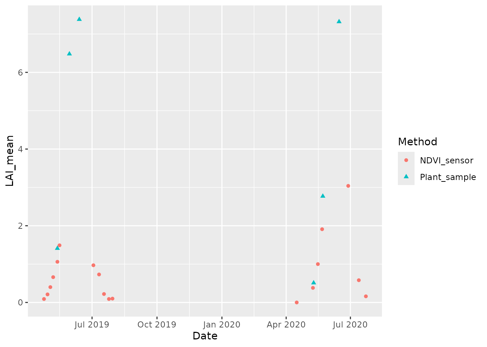
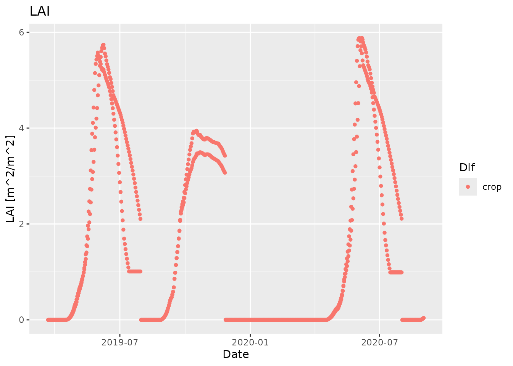
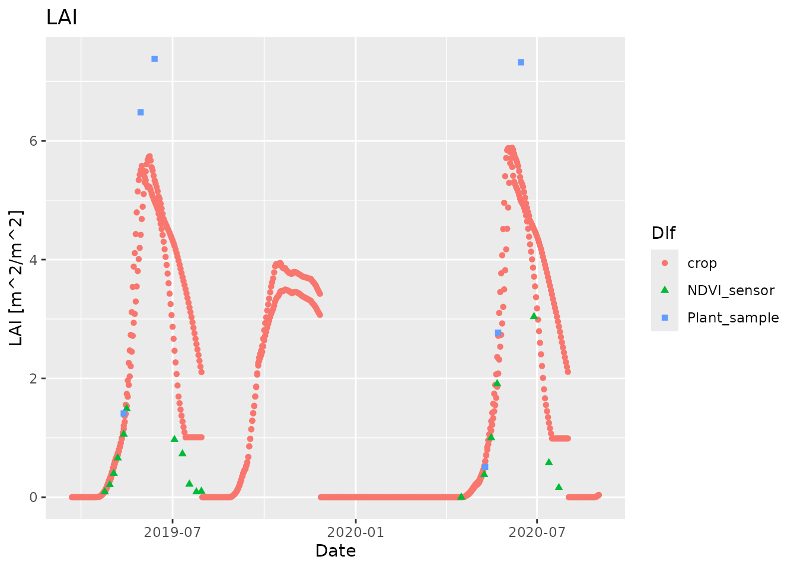
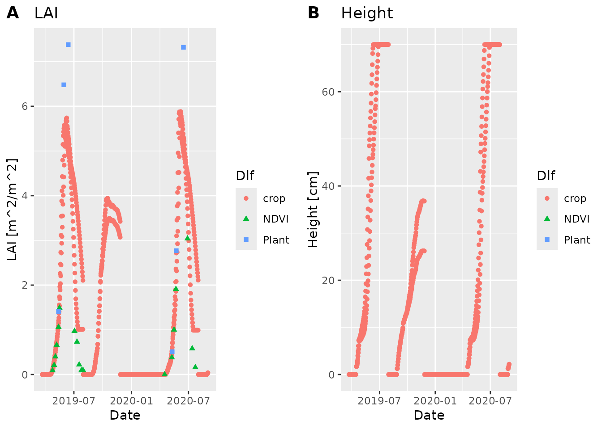

# Compare simulated and measured data

``` r

library(daisyrVis)
library(ggplot2)
```

We are going to read and plot some measured and simulated data, so we
can visualize how well the simulated data match the measured data.

## Read, prepare and visualize measured data

We use the LAI field measurements from part 3 of the daisy course, which
is bundled with `daisyrVis`

``` r

data_dir <- system.file("extdata", package="daisyrVis")
field_path <- file.path(data_dir, "daisy-course/03/field_LAI.csv")
field <- read.csv(field_path)
head(field)
#>                      Date year month day Nitrogen_Level      Method NDVI_mean
#> 1 2019-04-23 22:00:00 UTC 2019     4  23            160 NDVI_sensor      0.29
#> 2 2019-04-28 22:00:00 UTC 2019     4  28            160 NDVI_sensor      0.40
#> 3 2019-05-02 22:00:00 UTC 2019     5   2            160 NDVI_sensor      0.54
#> 4 2019-05-06 22:00:00 UTC 2019     5   6            160 NDVI_sensor      0.67
#> 5 2019-05-12 22:00:00 UTC 2019     5  12            160 NDVI_sensor      0.79
#> 6 2019-05-15 22:00:00 UTC 2019     5  15            160 NDVI_sensor      0.85
#>   NDVI_SE NDVI_CL_lower NDVI_CL_Upper LAI_mean LAI_SE LAI_CL_lower LAI_CL_upper
#> 1    0.01          0.28          0.30     0.09     NA         0.08         0.10
#> 2    0.01          0.38          0.43     0.21     NA         0.18         0.25
#> 3    0.02          0.50          0.58     0.40     NA         0.34         0.47
#> 4    0.02          0.63          0.71     0.66     NA         0.56         0.78
#> 5    0.01          0.75          0.83     1.06     NA         0.89         1.30
#> 6    0.01          0.82          0.87     1.49     NA         1.29         1.78
```

The csv file contains measurements obtained with two methods,
`NDVI_sensor` and `Plant_sample`, at two nitrogen levels, 0 and 160. We
want to include both methods, but only nitrogen level 160.

``` r

field <- field[field$Nitrogen_Level == 160, ]
```

In order to get proper handling of the dates when plotting, we need to
convert the datetime strings to `POSIXct` objects

``` r

field$Date <- as.POSIXct(field$Date, "%Y-%m-%d %H:%M:%S", tz="utc")
```

For the field data we will directly use `ggplot2` to get a quick
visualization.

``` r

ggplot(data=field, mapping=aes(x=Date, y=LAI_mean, group=Method, color=Method,
                                shape=Method)) + geom_point()
#> Warning: Removed 7 rows containing missing values or values outside the scale range
#> (`geom_point()`).
```



## Read, prepare and visualize simulated data

We use simulated LAI measurements from part 3 of the daisy course, which
is bundled with `daisyrVis`.

``` r

sim_dir <- file.path(data_dir, "daisy-course/03/Output")
sim <- read_dlf(sim_dir, pattern="crop\\.csv")
names(sim)
#> [1] "crop"
head(sim[[names(sim)[1]]]@data)
#>   year month mday hour DS Height LAI Depth WLeaf WDead WStem WSOrg WRoot
#> 1 2019     3   22    0  0      0   0     0     0     0     0     0     0
#> 2 2019     3   23    0  0      0   0     0     0     0     0     0     0
#> 3 2019     3   24    0  0      0   0     0     0     0     0     0     0
#> 4 2019     3   25    0  0      0   0     0     0     0     0     0     0
#> 5 2019     3   26    0  0      0   0     0     0     0     0     0     0
#> 6 2019     3   27    0  0      0   0     0     0     0     0     0     0
#>   Fixated NLeaf NDead NStem NSOrg NRoot water_stress nitrogen_stress Phenology
#> 1       0     0     0     0     0     0            0               0         0
#> 2       0     0     0     0     0     0            0               0         0
#> 3       0     0     0     0     0     0            0               0         0
#> 4       0     0     0     0     0     0            0               0         0
#> 5       0     0     0     0     0     0            0               0         0
#> 6       0     0     0     0     0     0            0               0         0
#>   sim       time
#> 1 New 2019-03-22
#> 2 New 2019-03-23
#> 3 New 2019-03-24
#> 4 New 2019-03-25
#> 5 New 2019-03-26
#> 6 New 2019-03-27
```

There are two simulations `Olde/crop` and `New/crop`. Hopefully we will
see a better fit to field data for the new one.

We again need to represent datetime with `POSIXct` objects

``` r

sim <- daisy_time_to_timestamp(sim, "Date")
head(sim[[names(sim)[1]]]$Date)
#> [1] "2019-03-22 UTC" "2019-03-23 UTC" "2019-03-24 UTC" "2019-03-25 UTC"
#> [5] "2019-03-26 UTC" "2019-03-27 UTC"
```

For the simulated data we will use the plot function `plot_dlf` from
`daisyrVis`, which knows how to plot multiple variables from multiple
`Dlf` objects together.

``` r

plot_dlf(sim, "Date", "LAI", "points")
```



## Visualize simulated and measured data together

We can combine the simulated and measured data in one plot by first
plotting the simulated data and then adding the measured data

``` r

plot_dlf(sim, "Date", "LAI", "points") +
  geom_point(data=field, mapping=aes(x=Date, y=LAI_mean, group=Method,
                                     fill=Method, color=Method, shape=Method))
#> Warning: Removed 7 rows containing missing values or values outside the scale range
#> (`geom_point()`).
```


This works because `plot_dlf` returns a `ggplot`object that we can add
additional data and plots to. Note that this only works when you plot a
single variable. If you use `point_and_lines` to plot multiple variables
in different subplots, then you need to do things a bit differently.

## Visualize simulated and measured data together for multiple variables

In order to plot multiple variables from different sources, we need to
have everything as `Dlf`objects using the same column names

``` r

ndvi <- field[field$Method == "NDVI_sensor", c("Date", "LAI_mean")]
plant <- field[field$Method == "Plant_sample", c("Date", "LAI_mean")]

field_dlfs <- list(
  NDVI=new("Dlf", header=list(info="Measured field data (NDVI sensor)"),
           units=data.frame(Date="", LAI="", Height="cm"),
           data=data.frame(Date=ndvi$Date, LAI=ndvi$LAI_mean,
                           Height=rep(NA, nrow(ndvi)))),
  Plant=new("Dlf", header=list(info="Measured field data (Plant samples)"),
            units=data.frame(Date="", LAI="", Height="cm"),
            data=data.frame(Date=plant$Date, LAI=plant$LAI_mean,
                            Height=rep(NA, nrow(plant)))))
```

``` r

plot_dlf(c(sim, field_dlfs), "Date", c("LAI", "Height"), "points")
#> Warning: Removed 7 rows containing missing values or values outside the scale range
#> (`geom_point()`).
#> Warning: Removed 31 rows containing missing values or values outside the scale range
#> (`geom_point()`).
```



``` r

# nolint end
```
