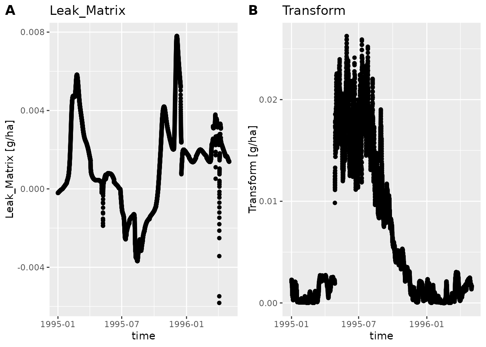
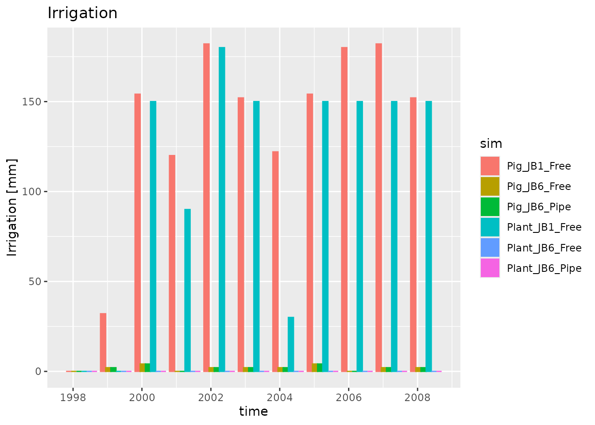

# Plotting dlfs

``` r

library(daisytools)
```

There is a general plot function `plot_dlf` that handles both single
files and list of files as returned by `read_dlf`.

## Plotting data from a directory of dlf files

To get started we will read some dlf files with `read_dlf`

``` r

data_dir <- system.file("extdata", package="daisytools")
dlfs <- read_dlf(file.path(data_dir, "annual"))
names(dlfs)
#> [1] "Annual-FN/HourlyP-Annual-FN-2-2b"        
#> [2] "Annual-FN/HourlyP-Annual-FN-2-3b"        
#> [3] "Annual-FN/HourlyP-Annual-FN-2-4b"        
#> [4] "Annual-FN/HourlyP-Annual-FN-2-5b"        
#> [5] "Annual-Tracer/HourlyP-Annual-Tracer-2-2b"
#> [6] "Annual-Tracer/HourlyP-Annual-Tracer-2-3b"
#> [7] "Annual-Tracer/HourlyP-Annual-Tracer-2-4b"
#> [8] "Annual-Tracer/HourlyP-Annual-Tracer-2-5b"
```

`plot_dlf` can only plot multiple dlf files with the same columns. The
data we just read contains data from two different log types and
multiple scenarios

``` r

colnames(dlfs[[1]]@data)
#>  [1] "year"                   "month"                  "mday"                  
#>  [4] "hour"                   "Min_Surface_Fertilizer" "Min_Soil_Fertilizer"   
#>  [7] "Deposition"             "Matrix_Leaching"        "Biopore_Leaching"      
#> [10] "Soil_Drain"             "Biopore_Drain"          "Surface_Loss"          
#> [13] "Min_Surface"            "Min_Soil"               "Min_Biopores"          
#> [16] "Error"                  "Mineralization"         "Immobilization"        
#> [19] "Crop_Uptake"            "Volatilization"         "N2O_Nitrification"     
#> [22] "Denitrification"        "Fixated"                "Org_Fertilizer"        
#> [25] "Seed"                   "Harvest"                "Residuals_Surface"     
#> [28] "Residuals_Soil"         "Org_Surface"            "Org_Soil"              
#> [31] "Crop"                   "time"
colnames(dlfs[[8]]@data)
#>  [1] "year"              "month"             "mday"             
#>  [4] "hour"              "Spray"             "Deposit"          
#>  [7] "Harvest"           "Dissipate"         "Litter Decompose" 
#> [10] "Litter Transform"  "Surface Decompose" "Surface Transform"
#> [13] "Runoff"            "Leak matrix"       "Leak biopores"    
#> [16] "Biopore drain"     "Soil drain"        "Surface drain"    
#> [19] "External"          "Uptake"            "Soil Decompose"   
#> [22] "Soil Transform"    "Snow"              "Canopy"           
#> [25] "Litter"            "Surface"           "Soil"             
#> [28] "Biopores"          "Error"             "time"
```

So we need to select a subset of the files that have the same columns.

``` r

dlfs <- dlfs[c(1, 2, 3, 4)]
names(dlfs)
#> [1] "Annual-FN/HourlyP-Annual-FN-2-2b" "Annual-FN/HourlyP-Annual-FN-2-3b"
#> [3] "Annual-FN/HourlyP-Annual-FN-2-4b" "Annual-FN/HourlyP-Annual-FN-2-5b"
dlfs <- drop_dir_from_names(dlfs)
dlfs <- strip_common_prefix_from_names(dlfs)
names(dlfs)
#> [1] "2b" "3b" "4b" "5b"
```

These dlfs contain annually logged variables related to field nitrogen

``` r

colnames(dlfs[[1]]@data)
#>  [1] "year"                   "month"                  "mday"                  
#>  [4] "hour"                   "Min_Surface_Fertilizer" "Min_Soil_Fertilizer"   
#>  [7] "Deposition"             "Matrix_Leaching"        "Biopore_Leaching"      
#> [10] "Soil_Drain"             "Biopore_Drain"          "Surface_Loss"          
#> [13] "Min_Surface"            "Min_Soil"               "Min_Biopores"          
#> [16] "Error"                  "Mineralization"         "Immobilization"        
#> [19] "Crop_Uptake"            "Volatilization"         "N2O_Nitrification"     
#> [22] "Denitrification"        "Fixated"                "Org_Fertilizer"        
#> [25] "Seed"                   "Harvest"                "Residuals_Surface"     
#> [28] "Residuals_Soil"         "Org_Surface"            "Org_Soil"              
#> [31] "Crop"                   "time"
```

We can plot all the variables, or a subset. Here we plot “Surface_Loss”
and “Denitrification”.

``` r

y_vars <- c("Surface_Loss", "Denitrification")
plot_dlf(dlfs, "year", y_vars, type="bar")
```


Notice how `plot_dlf` plots each variable in a separate sub plot, and
each scenario (AKA dlf) with a different color.

We can also make a line or points plot, or combine the plots types

``` r

plot_dlf(dlfs, "year", y_vars, "lines")
```


``` r

plot_dlf(dlfs, "year", y_vars, "points")
```


``` r

plot_dlf(dlfs, "year", y_vars, "lines-points-bar")
```


The lines and points plot types are usually better suited when we have
more data points. To see this we will load another dlf file using
`read_dlf`

``` r

path <- file.path(data_dir, "hourly/P2D-Daily-Soil_Chemical_110cm.dlf")
dlf <- read_dlf(path)
colnames(dlf@data)
#>  [1] "year"                    "month"                  
#>  [3] "mday"                    "hour"                   
#>  [5] "In_Matrix"               "In_Biopores"            
#>  [7] "Leak_Matrix"             "Leak_Biopores"          
#>  [9] "Biopores to matrix"      "Matrix to biopores"     
#> [11] "Tillage"                 "Drain_Soil"             
#> [13] "Drain_Biopores"          "Drain_Biopores_Indirect"
#> [15] "External"                "Uptake"                 
#> [17] "Decompose"               "Transform"              
#> [19] "Content"                 "Biopores"               
#> [21] "Error"                   "time"
```

``` r

y_vars <- c("Leak_Matrix", "Transform")
plot_dlf(dlf, "time", y_vars, "points")
#> Ignoring unknown labels:
#> • fill : "sim"
#> • colour : "sim"
#> • shape : "sim"
#> Ignoring unknown labels:
#> • fill : "sim"
#> • colour : "sim"
#> • shape : "sim"
```



If we only want to plot a part of the time period we can use
`subset_dlf`

``` r

summer95 <- subset_dlf(dlf, "1995-06-01", "1995-08-31")
plot_dlf(summer95, "time", y_vars, "lines", title_suffix=" - Summer of '95")
#> Ignoring unknown labels:
#> • fill : "sim"
#> • colour : "sim"
#> • shape : "sim"
#> Ignoring unknown labels:
#> • fill : "sim"
#> • colour : "sim"
#> • shape : "sim"
```


## Plotting Daisy spawn output

To get started we will read some dlf files with `read_dlf`

``` r

data_dir <- system.file("extdata", package="daisytools")
path <- file.path(data_dir, "daisy-spawn-like")
dlfs <- read_dlf(path)
names(dlfs)
#> [1] "FWater200-Y" "Harvest"
```

As before we need to ensure that we only plot dlfs with the same
columns. In this case `read_dlf` has done most of the work for us and we
can directly index the list of dlfs

``` r

colnames(dlfs$Harvest@data)
#>  [1] "year"    "month"   "day"     "column"  "crop"    "stem_DM" "dead_DM"
#>  [8] "leaf_DM" "sorg_DM" "stem_N"  "dead_N"  "leaf_N"  "sorg_N"  "WStress"
#> [15] "NStress" "WP_ET"   "HI"      "sim"     "time"
plot_dlf(dlfs$Harvest, "time", "leaf_DM", "lines")
```


We can of course also plot the other log type

``` r

colnames(dlfs$`FWater200-Y`@data)
#>  [1] "year"                         "month"                       
#>  [3] "mday"                         "hour"                        
#>  [5] "Precipitation"                "Irrigation"                  
#>  [7] "Potential evapotranspiration" "Actual evapotranspiration"   
#>  [9] "Matrix percolation"           "Biopore percolation"         
#> [11] "Matrix drain flow"            "Biopore drain flow"          
#> [13] "Runoff"                       "Biopore water"               
#> [15] "Soil matrix water"            "Surface water"               
#> [17] "sim"                          "time"
plot_dlf(dlfs$`FWater200-Y`, "time", "Irrigation", "bar")
```



## Plotting depth distributed output

To get started we will read a dlf file with `read_dlf`

``` r

data_dir <- system.file("extdata", package="daisytools")
path <- file.path(data_dir, "daily/DailyP/DailyP-Daily-WaterFlux.dlf")
dlf <- read_dlf(path)
head(dlf)
#>   year month mday hour       time z        q
#> 1 1990     4    2    0 1990-04-02 0 0.686972
```

`plot_dlf` does not yet support plotting depth data. Instead you have to
use `plot_dlf_depth`

``` r

plot_dlf_depth(dlf, "q")
```

 By
default `plot_dlf_depth` selects four time points at random. You can
also pass the desired time points

``` r

plot_dlf_depth(dlf, "q", c("1990-04-23", "1990-04-27"))
```


Depth distributed data is often better visualized by animating it. This
can be done with `animate_dlf`. Try running `example(animate_dlf)`.
