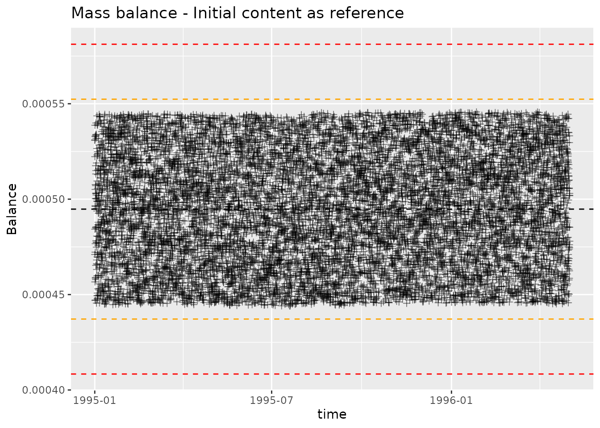
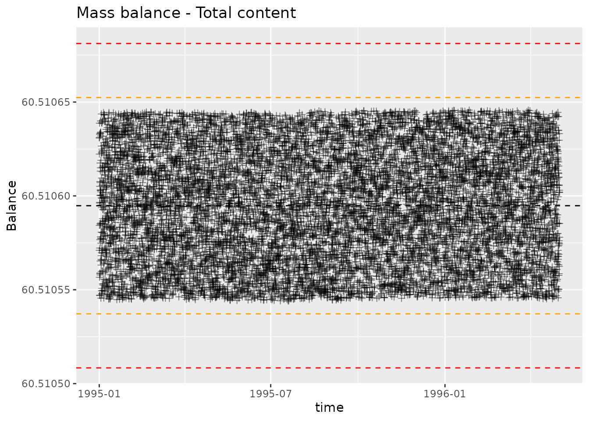

# Mass balance

``` r

library(daisyrVis)
```

We are going to read a dlf file and then calculate, summarize and plot
mass balance. For this we will use the soil chemical log bundled with
`daisyrVis`.

``` r

data_dir <- system.file("extdata", package="daisyrVis")
path <- file.path(data_dir, "hourly/P2D-Daily-Soil_Chemical_110cm.dlf")
dlf <- read_dlf(path)
## We don't need timestamps for the mass balance calculation, but we need it for
## plotting later.
dlf <- daisy_time_to_timestamp(dlf)
names(dlf@data)
#>  [1] "year"                    "month"                  
#>  [3] "mday"                    "hour"                   
#>  [5] "In_Matrix"               "In_Biopores"            
#>  [7] "Leak_Matrix"             "Leak_Biopores"          
#>  [9] "Biopores to matrix"      "Matrix to biopores"     
#> [11] "Tillage"                 "Drain_Soil"             
#> [13] "Drain_Biopores"          "Drain_Biopores_Indirect"
#> [15] "External"                "Uptake"                 
#> [17] "Decompose"               "Transform"              
#> [19] "Content"                 "Biopores"               
#> [21] "Error"                   "time"
nrow(dlf@data)
#> [1] 11665
```

In order to do a mass balance calculation, we need to define which
variables are input, output and content variables. In this case we use

``` r

input <- c("In_Matrix", "In_Biopores", "External", "Transform", "Tillage")
output <- c("Decompose", "Leak_Matrix", "Leak_Biopores", "Drain_Soil",
            "Drain_Biopores", "Uptake")
content <- c("Content", "Biopores")
```

## Mass balance summary

We can use the function `mass_balance_summary` to summarize the mass
balance at the final timestep. The result is a list containing the sum
of each input and the total input; the sum of each output and the total
output; the value of each initial content and total initial content; the
value of each final content and total final content; and the final
balance calculation.

``` r

mbs <- mass_balance_summary(dlf, input, output, content)
mbs$Inputs
#>   In_Matrix In_Biopores    External   Transform     Tillage       Total 
#>     0.00000     0.00000     0.00000    68.19174     0.00000    68.19174
mbs$Outputs
#>      Decompose    Leak_Matrix  Leak_Biopores     Drain_Soil Drain_Biopores 
#>     44.3881377     13.4851340      0.3371014      0.3095327     13.5879370 
#>         Uptake          Total 
#>      0.0000000     72.1078427
mbs$InitialContent
#>   Content    Biopores   Total
#> 1 60.5101 9.80239e-19 60.5101
mbs$FinalContent
#>   Content   Biopores    Total
#> 1  56.593 0.00147698 56.59448
mbs$Balance
#>      Input   Output InOutChange InitialContent FinalContent ContentChange
#> 1 68.19174 72.10784    3.916101        60.5101     56.59448     -3.915623
#>        Balance
#> 1 0.0004779899
```

## Mass balance at each timestep

We can use the function `mass_balance` to calculate a mass balance at
each timestep. When calculating mass balance we can either use the
initial content as reference or get total mass

``` r

mb_ref <- mass_balance(dlf, input, output, content)
mb_total <- mass_balance(dlf, input, output, content, FALSE)
```

`mass_balance` returns a `Dlf` object with a mass balance calculation
for each timestep

``` r

names(mb_ref@data)
#>  [1] "year"                    "month"                  
#>  [3] "mday"                    "hour"                   
#>  [5] "In_Matrix"               "In_Biopores"            
#>  [7] "Leak_Matrix"             "Leak_Biopores"          
#>  [9] "Biopores to matrix"      "Matrix to biopores"     
#> [11] "Tillage"                 "Drain_Soil"             
#> [13] "Drain_Biopores"          "Drain_Biopores_Indirect"
#> [15] "External"                "Uptake"                 
#> [17] "Decompose"               "Transform"              
#> [19] "Content"                 "Biopores"               
#> [21] "Error"                   "time"                   
#> [23] "input_sum"               "output_sum"             
#> [25] "content_sum"             "balance"
nrow(mb_ref@data)
#> [1] 11665
```

### Plotting mass balance

We can plot the mass balance calculation with `plot_mass_balance`. This
will produce a controlchart plot, where each point is plotted alongside
lines indicating mean, mean ± 2 standard deviations, mean ± 3 standard
deviations. The point of the plot is twofold, highlight points with
large deviation and highlight systematic change in deviations. We want
to check that the magnitude of deviations is acceptable, and that the
distribution of deviations is consistent over time.

``` r

plot_mass_balance(mb_ref, "time", " - Initial content as reference")
#> Ignoring unknown labels:
#> • fill : "Dlf"
#> • colour : "Dlf"
#> • shape : "Dlf"
```



``` r

plot_mass_balance(mb_total, "time", " - Total content")
#> Ignoring unknown labels:
#> • fill : "Dlf"
#> • colour : "Dlf"
#> • shape : "Dlf"
```


